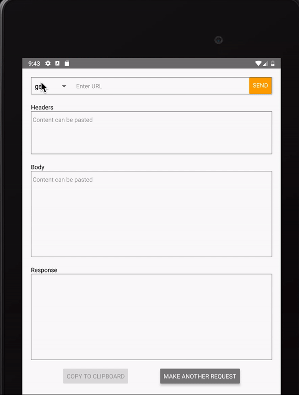

# react-native-http-module
**react-native-http-module** is a light weight library that provides the functionality to make sample HTTP requests.

### WHY react-native-http-module ?
React-native basically uses XHR to make API requests. But the **android Wear OS** does not support XHR requests. Hence the need to build this custom library has come. 

This **react-native-http-module** library supports **HTTP requests in wear OS**. 

Being **promise based** is another advantage of this library

## GETTING STARTED
`$ npm install react-native-http-module --save`

#### MOSTLY AUTOMATIC INSTALLATION
`$ react-native link react-native-http-module (in react-native versions <= 60)`

### CURRENT SUPPORT & USAGE
This react-native-http-module library currently supports/exports the basic methods(get, post & request) to make a API request.
The *request* method supports all the available methods like get, post, delete, put...

```javascript
import HttpModule from 'react-native-http-module';

const httpModule = new HttpModule(baseURL, headers);
```
This module supports a default constructor that takes the following args:
* *baseURL - The application's default endpoint URL. If this is empty, complete endpoint URL given is considered.*
* *headers - The default headers that can be set for set of upcoming requests.*

#### GET
```javascript
httpModule.get(URL, HEADERS).then(...).catch(...);
```

#### POST
```javascript
httpModule.post(URL, HEADERS, BODY).then(...).catch(...);
```

#### REQUEST
```javascript
httpModule.request(URL, METHOD: 'get'|'post'|'delete'|'put', HEADERS, BODY).then(...).catch(...);
```

### EXAMPLE



```javascript
import React, {useState} from 'react';
import {
  Text,
  View,
  Button,
  Picker,
  TextInput,
  StyleSheet,
  Clipboard,
} from 'react-native';
import HTTPModule from 'react-native-http-module-mroads';

const styles = StyleSheet.create({
  container: {flex: 1, padding: 20},
  urlContainer: {
    flexDirection: 'row',
    marginBottom: 20,
    borderColor: 'gray',
    borderWidth: 1,
    height: 40,
  },
  type: {height: 40, width: 100},
  url: {height: 40, width: '72.8%'},
  send: {height: 40, backgroundColor: 'orange'},
  inputText: {
    borderColor: 'gray',
    borderWidth: 1,
    marginBottom: 20,
    textAlignVertical: 'top',
  },
  headers: {height: 100},
  body: {height: 200},
  response: {height: 200},
});

const API = () => {
  const [type, setType] = useState('get');
  const [url, setURL] = useState('');
  const [headers, setHeaders] = useState(null);
  const [body, setBody] = useState(null);
  const [response, setResponse] = useState(null);
  
  const sendRequest = () => {
    if (!url || !type) {
      return;
    }
    new HTTPModule().request(url, type, headers, body)
      .then(response => setResponse(response))
      .catch(error => setResponse(error));
  };

  return (
    <View style={styles.container}>
      <View style={styles.urlContainer}>
        <Picker
          selectedValue={type}
          style={styles.type}
          onValueChange={itemValue => setType(itemValue)}>
          <Picker.Item label="get" value="get" />
          <Picker.Item label="post" value="post" />
        </Picker>
        <TextInput
          style={styles.url}
          onChangeText={text => setURL(text)}
          value={url}
          placeholder="Enter URL"
        />
        <Button title="SEND" onPress={sendRequest} color="orange" />
      </View>
      <Text>Headers</Text>
      <TextInput
        style={[styles.inputText, styles.headers]}
        onChangeText={text => setHeaders(JSON.parse(text))}
        value={headers}
      />
      <Text>Body</Text>
      <TextInput
        style={[styles.body, styles.inputText]}
        onChangeText={text => setBody(JSON.parse(text))}
        value={body}
      />
      <Text>Response</Text>
      <View>
        <TextInput
          style={[styles.response, styles.inputText]}
          selectable
          editable={false}
          numberOfLines={20}
          onChangeText={text => setResponse(text)}
          value={response}
        />
      </View>
    </View>
  );
};
export default API;
```